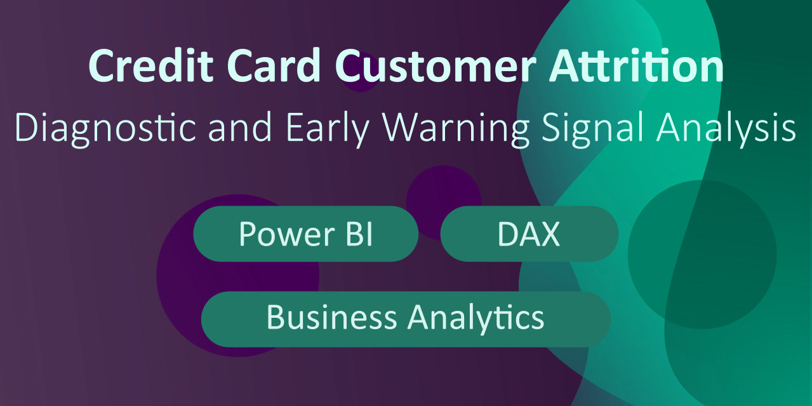
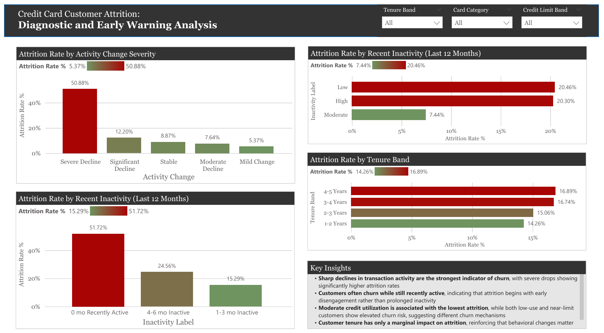

## Profit Margin Analysis: US E-Commerce Sales 2020

### Business Question
#### Which products and customer behaviors drive revenue but destroy profit?

### Dataset
United States E-Commerce Records (2020)

### Tools
- Power BI
- Power Query (M)
- DAX

### Dashboard Pages
1. Executive Overview: Revenue vs Profit Overview

### Key Insights
Page 1:
- While the business remains profitable overall, some products generate negative profit. This is not necessarily an issue, as loss-leading products can be part of a deliberate pricing strategy. However, identifying these products helps distinguish between strategic trade-offs and potential inefficiencies.

2. Discount Impact: Discount Impact o Profitability

### Key Insights
Page 2:
- Orders may contain multiple products with different discount rates. A revenue-weighted discount is used to reflect the true financial impact of discounting and avoid misleading averages.
- Orders with weighted discounts above 40% consistently generate negative profit margins, indicating aggressive discounting as the main loss driver.
- Profit margins remain positive at low discount levels but decline sharply beyond 20-30%. Discounts above 40% consistently generate losses across all categories, with Office Supplies showing the steepest margin erosion. This suggests a critical discount threshold beyond which revenue growth comes at the expense of profitability

3. Loss Leader Strategy: Basket Analysis

### Key Insights
Page 3:
- The Order Size vs Profitability chart shows that loss leader strategy fails when the items are sold as single items.
- The Order Size vs Profitability chart shows that deep discounts are most dangerous when the customer only buys one discounted items. Even if one item in a 6-item basket is heavily discounted, the other 5 items are likely pulling the total order profit back into the positive zone.
- The diagonal numbers (564, 1272, 526) in the Basket Analysis chart represents orders where the customer only bought items from that one category. Because the 1272 orders have no other category in the basket to offset the losses, any discount given on these is a direct hit to the bottom line with no secondary benefit.
- Mixed baskets by category is safer
- The profit margin by basket size band is calculated as total profit divided by total sales. The chart shows that Small Baskets (2-3 items) are the peak.
- The Basket Analysis matrix explains multi-item orders often include a mix of categories such 316 (technology and office supplies) where the profitable items protect the total order margin from dipping below zero.

### Business Recommendation
- Eliminate deep discounts on "isolated" single-item orders
- While small baskets (2-3 item) are the most efficient profit engine, single-item transactions represent a high-risk "gambling" zone.
- By making discounts contingent on a basket mix, the business can force a cross-sell that uses stable categories like technology to shield against the volatility of discounted Furniture or Office Supplies.
